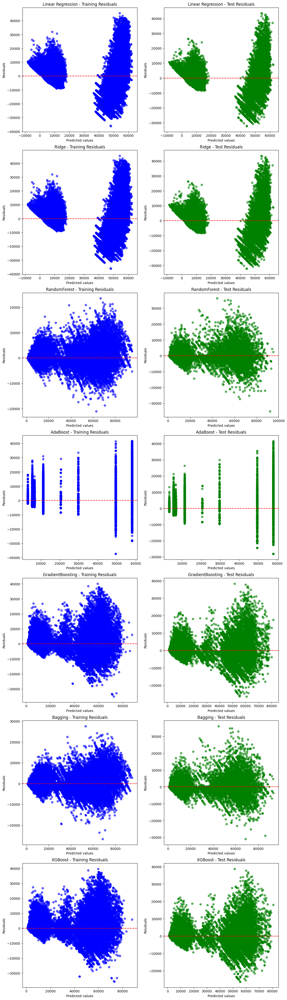

# Flight Price Prediction

## Overview
This project aims to predict flight ticket prices using machine learning models based on data obtained from the "Ease My Trip" website. Various models were trained, tuned, and evaluated to achieve the best performance.
- ** This is just an overview of the dataset and insights obtained. Please view the "Flight_price_predictive_analytics.ipynb" file to see the full code along with EDA and Visualizations.**
- ** Initially, this project utilized interactive visualizations created with **Plotly** for data exploration and analysis. Plotly charts offer dynamic and interactive features, such as zooming, panning, and tooltips, which enhance exploratory data analysis. However, **GitHub README files and PDF exports** do not support interactive elements, which means these visualizations would not render properly in these formats. So, some images are displayed as static images.

## Table of Contents
- [Overview](#overview)
- [Dataset](#dataset)
- [Data Preprocessing](#data-preprocessing)
- [Exploratory Data Analysis (EDA)](#exploratory-data-analysis-eda)
- [Modeling](#modeling)
- [Model Evaluation](#model-evaluation)
- [Feature Importance](#feature-importance)
- [Single Prediction and Model Deployment](#single-prediction-and-model-deployment)
- [Insights and Results](#insights-and-results)
- [Future Improvements](#future-improvements)
- [Contributors](#contributors)

## Dataset
The dataset consists of flight booking data obtained from the "Ease My Trip" website. It contains 300,261 records and 11 features. The Dataset is cleaned (300,153 rows and 11 columns). Originally the dataset is of 2 parts "business" and "economy". I have also uploaded to the repository just for reference. The dataset includes the following features:
- `Airline`: Name of the airline (categorical)
- `Flight`: Flight code (categorical)
- `Source City`: Departure city (categorical)
- `Departure Time`: Time of departure (categorical)
- `Stops`: Number of stops (categorical)
- `Arrival Time`: Time of arrival (categorical)
- `Destination City`: Arrival city (categorical)
- `Class`: Ticket class (Business/Economy) (categorical)
- `Duration`: Flight duration in hours (numerical)
- `Days Left`: Days left for departure (numerical)
- `Price`: Ticket price (target variable)

## Data Preprocessing
The preprocessing steps include:
- Handling missing values.
- Removing outliers (prices greater than 100,000).
- Scaling numerical features using `MinMaxScaler`.
- Encoding categorical features using `OneHotEncoder`.

## Exploratory Data Analysis (EDA)
EDA was conducted to understand the distribution of variables and identify patterns. Key findings include:
- Ticket prices vary significantly based on the airline, class, stops, and source/destination cities.
- Business class tickets are generally more expensive than economy class.
- Prices increase as the departure date approaches.

### Distribution of Variables
- **Numerical variables**: Histograms and boxplots were used to visualize the distribution of numerical variables like `duration`, `days_left`, and `price`.
- **Categorical variables**: Bar plots were used to display the distribution of categorical variables such as `airline`, `source_city`, and `class`.

## Modeling
Various models were trained to predict ticket prices:
- **Initial Models**: LinearRegression, Ridge, RandomForest, AdaBoost, GradientBoosting, Bagging, XGBoost.
- **Tuning**: Hyperparameter tuning was performed using `GridSearchCV` to optimize each model.
- **Performance Metrics**: Models were evaluated using MAE, MSE, RMSE, R² Score, Explained Variance, and MAPE (%).

## Model Evaluation
### Initial Model Performance
The results of the initial models are as follows:
| Model            | MAE     | MSE       | RMSE    | R² Score | Explained Variance | MAPE (%) |
|------------------|---------|-----------|---------|----------|---------------------|----------|
| LinearRegression | 4542.11 | 4.48e+07  | 6690.53 | 0.9126   | 0.9126              | 46.38    |
| Ridge            | 4540.50 | 4.48e+07  | 6689.85 | 0.9127   | 0.9127              | 46.35    |
| RandomForest     | 1039.57 | 7.08e+06  | 2660.07 | 0.9862   | 0.9862              | 6.83     |
| AdaBoost         | 3682.16 | 3.39e+07  | 5819.65 | 0.9339   | 0.9360              | 31.62    |
| GradientBoosting | 2898.78 | 2.36e+07  | 4854.98 | 0.9540   | 0.9540              | 20.41    |
| Bagging          | 1067.74 | 7.58e+06  | 2753.92 | 0.9852   | 0.9852              | 7.08     |
| XGBoost          | 1911.66 | 1.11e+07  | 3332.51 | 0.9783   | 0.9783              | 14.25    |

### Tuned Model Performance
After tuning, the performance improved for most models:
| Model            | MAE     | MSE       | RMSE    | R² Score | Explained Variance | MAPE (%) |
|------------------|---------|-----------|---------|----------|---------------------|----------|
| LinearRegression | 4542.05 | 4.48e+07  | 6689.91 | 0.9127   | 0.9127              | 46.38    |
| Ridge            | 4540.51 | 4.48e+07  | 6689.85 | 0.9127   | 0.9127              | 46.35    |
| RandomForest     | 1044.56 | 6.65e+06  | 2579.67 | 0.9870   | 0.9870              | 6.97     |
| AdaBoost         | 3464.31 | 3.25e+07  | 5698.47 | 0.9366   | 0.9366              | 27.42    |
| GradientBoosting | 2469.58 | 1.80e+07  | 4241.93 | 0.9649   | 0.9649              | 17.21    |
| Bagging          | 1097.09 | 6.69e+06  | 2585.69 | 0.9870   | 0.9870              | 7.51     |
| XGBoost          | 2497.15 | 1.84e+07  | 4283.87 | 0.9642   | 0.9642              | 17.22    |

## Feature Importance
- The **RandomForest model** was used to identify the most important features for predicting ticket prices.
- Top features include `duration`, `days_left`, `source_city`, and `airline`.

## Single Prediction and Model Deployment
- A sample input was used to demonstrate how the final model predicts ticket prices.
- The model was saved using `joblib` for deployment purposes.

## Insights and Results
- **RandomForest** was the best-performing model, achieving an R² Score of **0.987** and an MAE of **1,044**.
- Ticket prices increase as the departure date approaches, and business class tickets are consistently more expensive.
- The model can be used to help passengers make informed decisions about when to book flights.

## Residual Plots

- **RandomForest** shows the best performance, with residuals more randomly distributed and concentrated around zero.
- Linear models (LinearRegression, Ridge) are unable to capture non-linearity, as indicated by distinct patterns in residuals.
- Boosting models (GradientBoosting, XGBoost, AdaBoost) perform well, but RandomForest still has a slight edge in residual distribution.
- Ideal Residual Plot: For a perfect model, residuals should be randomly scattered around the zero line without any discernible patterns.
**Overall, these plots confirm that RandomForest is the best model in terms of capturing the underlying patterns of the data, with lower residuals and better fit.**

## Future Improvements
- Implement more advanced hyperparameter tuning techniques like **RandomizedSearchCV** or **Bayesian Optimization**.
- Integrate additional features like **seasonality** or **day of the week** to improve model accuracy.
- Deploy the model using a web application (e.g., Flask, Django) for real-time prediction.

## Contributors
- [Ali Zameeruddin Khan](https://github.com/zam334x)
- [LinkedIn](https://www.linkedin.com/in/alizameer2122)
